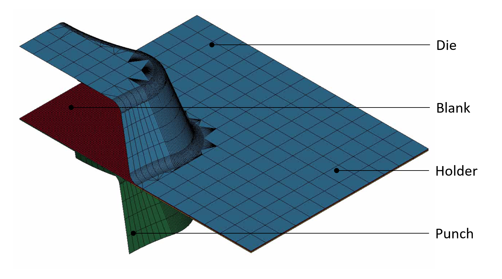

# Dataloader DFG SPP2422 Subproject 09

A Python dataloader implementation for accessing and processing the dataset from the research project "Robust active surface design for multi-stage sheet metal forming processes based on data- and calculation-based equivalent modelling of component springback" ([Project Link](https://www.ifu.uni-stuttgart.de/en/spp-2422/teilprojekte/page-00004/)).

## Table of Contents

- [Dataloader DFG SPP2422 Subproject 09](#dataloader-dfg-spp2422-subproject-09)
  - [Table of Contents](#table-of-contents)
  - [Overview](#overview)
  - [Dataset Details](#dataset-details)
    - [Component Features](#component-features)
    - [Metadata Structure](#metadata-structure)
      - [Geometric Parameters](#geometric-parameters)
      - [Material Parameters](#material-parameters)
  - [Installation](#installation)
  - [Dataset Structure](#dataset-structure)
  - [Usage](#usage)
    - [Examples](#examples)
    - [Basic Usage (main.py)](#basic-usage-mainpy)
  - [License](#license)
  - [Contact](#contact)
  - [Acknowledgements](#acknowledgements)

## Overview

This dataloader provides access to a comprehensive dataset containing 5,335 simulations of sheet metal forming processes. Each simulation includes interactions between four key components:
- Blank (with features: thickness, strain, and Mises stress)
- Die
- Punch
- Holder




## Dataset Details

### Component Features

The Blank component contains rich feature data:
- Thickness measurements
- Strain (three integration points)
- Mises Stress (three integration points)

Other components (Die, Punch, and Holder) are represented as point clouds only. Following gif demonstrates the features with a selected integration point (IP) of 2. 


### Metadata Structure

Each simulation includes two types of metadata:

#### Geometric Parameters
These parameters are constant across all simulations and are stored in the first three columns of the metadata file:

- Radius Concave: radius of the geometry
- Bottom Radius: radius at the bottom of the geometry.
- Part Wall Angle: the angle of the wall of the geometry-

#### Material Parameters
These parameters vary between simulations and define material properties:

- MAT: Material Scaling Factor
- FC: Friction Coefficient
- SHTK: Sheet Metal Thickness
- BF: Binder Force

## Installation

1. Clone the repository:
```bash
git clone https://github.com/BaumSebastian/dfg_spp_2422_09_dataloader/
cd dfg_spp_2422_09_dataloader
```

2. Install dependencies:
```bash
pip install -r requirements.txt
```

Note: PyTorch is not included in requirements.txt as it depends on your hardware configuration. Please install the appropriate version from the [PyTorch website](https://pytorch.org/).

3. Configure the dataset location:
```bash
python create_config.py
```
Follow the prompts to set your dataset directory.

## Dataset Structure

The dataset should be organized as follows:

```bash
/dataset
├── pc/                           # Point clouds
│   ├── id/                       # Simulation ID
│   │   ├── binder_0.npy         # Component points at timestep 0
│   │   ├── binder_1.npy
│   │   └── ...
├── ef/                           # Edge features 
│   ├── id/
│   │   ├── blank_indices.npy     # Node indices
│   │   ├── blank_thickness_0.npy # Features at timestep 0
│   │   └── ...
└── metadata.csv                  # Simulation parameters
```

## Usage

### Examples

Check out our Jupyter notebook examples:
- [Loading Point Clouds](./examples/point_cloud.ipynb)
- [Loading Point Clouds with Features](./examples/point_cloud_and_features.ipynb)

### Basic Usage ([main.py](./main.py))

```python
from src.dataset import FEMGraphDataset, LoadType

# Initialize dataset
dataset = FEMGraphDataset(
    geometries=['blank'],  # Choose geometries
    timesteps=[0, -1],     # Select timesteps
    load_type=LoadType.NODES_AND_FEATURES  # Set loading mode
)

# Access data
(parameters, point_clouds, node_indices, features)  = dataset[0]

for geometry, pc in zip(geometries, point_clouds):
    print(f"{geometry} shape: {pc.shape}")

print(f"Node indices shape: {node_indices.shape}")
print(f"Features shape: {features.shape}")
```

```bash
blank shape: torch.Size([2, 11236, 3])
punch shape: torch.Size([2, 1000, 3])
binder shape: torch.Size([2, 127, 3])
die shape: torch.Size([2, 1696, 3])
Node indices shape: torch.Size([22050, 3]) # node indices is constant for each timestep
Features shape: torch.Size([2, 22050, 7]) # thickness + 3*stress + 3*strain
```

## License

This project is licensed under the MIT License - see the [LICENSE](LICENSE) file for details.

## Contact

If you have any questions, simply get in touch with me using the following [contact details](https://www.ias.uni-stuttgart.de/institut/team/Baum-00001/)

## Acknowledgements  

The authors gratefully acknowledge the financial support provided by the project “Robust active surface design for multi-stage sheet metal forming processes based on data- and computation-driven surrogate modelling of springback behavior” as part of [DFG Project SPP 2422: “Data-driven process modelling in metal forming technology”](https://www.ifu.uni-stuttgart.de/en/spp-2422/) (ID: DFG - 500936349) with Spokesman Prof. Dr.-Ing. Mathias Liewald MBA