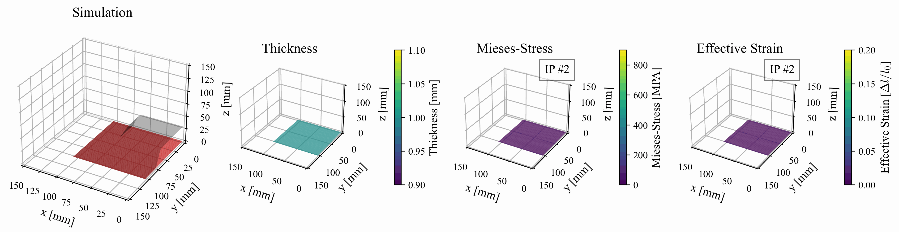

# Dataloader DFG SPP2422 Subproject 09

This is a dataloader implementation for the dataset published as part of the subproject "Robust active surface design for multi-stage sheet metal forming processes based on data- and calculation-based equivalent modelling of component springback" ([Link](https://www.ifu.uni-stuttgart.de/en/spp-2422/teilprojekte/page-00004/)).

## Table of Contents

- [Dataloader DFG SPP2422 Subproject 09](#dataloader-dfg-spp2422-subproject-09)
  - [Table of Contents](#table-of-contents)
  - [Introduction](#introduction)
  - [Data](#data)
    - [Geometric Parameters](#geometric-parameters)
    - [Material Parameter](#material-parameter)
  - [Installation](#installation)
  - [Usage](#usage)
    - [Dataset Structure](#dataset-structure)
    - [Configure the Dataset](#configure-the-dataset)
    - [Run the Code](#run-the-code)
    - [Modify Loading Parameters](#modify-loading-parameters)
  - [License](#license)
  - [Contact](#contact)
  - [Acknowledgements](#acknowledgements)

## Introduction

The aim of this project is the development of a novel design method for active surfaces of deep-drawing moulds based on a data- and calculation-based surrogate model. The surrogate model is built using Generative Adversarial Networks or Denoising Diffusion Probabilistic Models and is intended to learn and map the relationships between component geometry, the existing process parameters and the component springback. In addition, a delta modelling is set up based on the surrogate modelling, which is also intended to learn the deviations between the FE simulation and the real forming process. The data of the real forming process is obtained in systematic endurance tests and thus takes into account many other process parameters and disturbance effects that are only considered to a limited extent in the simulation. The FE simulation thus first learns known and modellable relationships by machine and then expands these with experimental process data. The surrogate and delta modelling ultimately forms the starting point for an active surface generator, which can generate an improved modelling of the active surfaces on the basis of the spring-back component geometries, e.g. using a gradient method, which already takes into account the spring-back to be expected in reality [[source]](https://www.ifu.uni-stuttgart.de/en/spp-2422/teilprojekte/page-00004/). As part of this project we publish a dataset, that will be accessible using this source code.

## Data

The dataset contains 5338 simulation, where each simulation consists of 4 geometries:
-  Blank
-  Die
-  Punch
-  Holder

// Image of simulation.

The simulation has three time steps and displays the movement of each geometry. While Die, Punch and Holder is only represented as point cloud, the Blank contains additional features.
The features are:
- Thickness
- Strain
- Misses Stress



Next to this, there are metadata stored for each simulation. The metadata is seperated into two differnt types of values:

- Geometric Parameters
- Material Parameters

### Geometric Parameters
The geometric parameters are constant for all simulations. The geometric paramters are the first three columns of the met
// Insert Image

### Material Parameter
While the geometric Parameters are constant for all simulations, the material aprameters differ and refer to following parameters:


## Installation

Instructions on how to install the necessary software and dependencies to run your project. This may include:

1. **Clone the repository:**

```bash
git clone https://github.com/BaumSebastian/dfg_spp_2422_09_dataloader/
cd dfg_spp_2422_09_dataloader
```

2. **Install dependencies:**

```bash
pip install -r requirements.txt
```

## Usage

To use the [FEMGraphDataset](src/dataset.py), follow these steps:

### Dataset Structure

The downloaded dataset should be structured as follows:

```bash
/dataset
├── pc/                           # Point clouds
│   ├── id/                       # Id of the simulation
│   │   ├── binder_0.npy          # Points (nodes) of the geometry 'binder' at time step 0
│   │   ├── binder_1.npy
│   │   ├── ...
│   │   ├── blank_n.npy
├── ef/                           # Edge features 
│   ├── id/                       # Id if the simulation
│   │   ├── blank_indices.npy     # Node indices of the features
│   │   ├── blank_thickness_0.npy # Feature 'thickness' of the geometry 'blank' at time step 0
│   │   ├── blank_thickness_1.npy
│   │   ├── ...
└─── metadata.csv                 # Metadata with an 'id' column and process/material parameters.
```

### Configure the Dataset

Set up the [config.yaml](config.yaml) file to define your dataset parameters.

```yaml
dataset:
  base_dir: "/path/to/your/dataset"  # Base directory for the dataset, where pc, ef and metadata.csv is located.
  ...
```

### Run the Code

Run the code according to the example in [main.py](main.py) script to load and explore the dataset.
The script will output dataset information, such as size and structure of the data samples. For example:

```bash
Dataset size: 5335
Sample keys: dict_keys(['nodes', 'edge_features'])
Nodes shape: torch.Size([100, 3])
Edge features shape: torch.Size([300, 1])
```

### Modify Loading Parameters

To customize what data to load, modify the [main.py](main.py) script:

- Geometries: As in [data explained](#data), the simulation contains 4 geometries. Specify as a list which geometry to load.
- Timesteps: Adjust the timesteps parameter to specify which timesteps to load (e.g., [0, -1] for the first and last).
- Load Type: Change the load_type to LoadType.NODES (only point clouds) or LoadType.NODES_AND_FEATURES (both nodes and edge features).

Example snippet from [`main.py`](./main.py#L16-L18):

```python
  geometries = ['blank'] # Select any amount of geometries out of the geometries in config.yaml
  timesteps = [0, -1] # The time steps of the simulation you want. It supports also negative indexing
  load_type = LoadType.NODES_AND_FEATURES # Nodes or Nodes and Features
```

## License

This project is licensed under the MIT License - see the [LICENSE](LICENSE) file for details.

## Contact

If you have any questions, simply get in touch with me using the following [contact details](https://www.ias.uni-stuttgart.de/institut/team/Baum-00001/)

## Acknowledgements  

The authors gratefully acknowledge the financial support provided by the project “Robust active surface design for multi-stage sheet metal forming processes based on data- and computation-driven surrogate modelling of springback behavior” as part of [DFG Project SPP 2422: “Data-driven process modelling in metal forming technology”](https://www.ifu.uni-stuttgart.de/en/spp-2422/) (ID: DFG - 500936349) with Spokesman Prof. Dr.-Ing. Mathias Liewald MBA